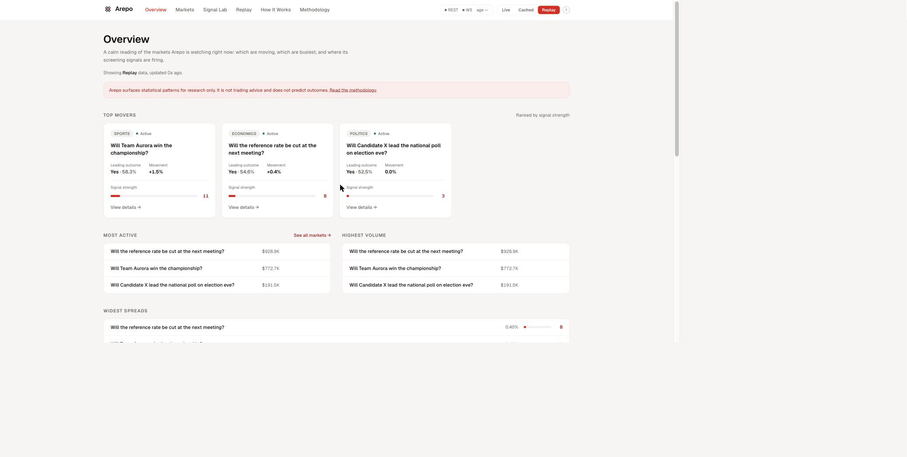
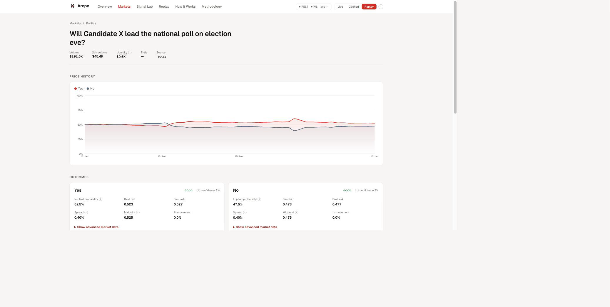

# Arepo

**Arepo reads the hidden signal between the lines.** It is a read-only research
instrument for prediction markets: it fixes a market's implied probability,
order-book microstructure and movement anomalies from public Polymarket data, and
explains every reading in plain English before showing the maths.

> Just as Arepo is believed to have been created to unite the Sator Square, we
> unite information as it is created, conviction as it is expressed, action as it
> is taken, and markets as they move. Arepo represents the hidden signal found
> between the lines.




> More captures are in [`docs/screenshots/`](docs/screenshots): the
> [Methodology](docs/screenshots/arepo-methodology.png) reference (with rendered
> maths), the [Replay backtest](docs/screenshots/arepo-replay.png), and the
> plain-English [How Arepo Works](docs/screenshots/arepo-how-it-works.png) guide.

**Live demo:** Not yet deployed, see [`docs/deployment.md`](docs/deployment.md).

---

## Disclaimer

Arepo is a **read-only research and screening tool**. It is not a betting site,
does not place trades, and holds no wallet or exchange credentials. The signals it
computes are **statistical screening heuristics**: they flag behaviour that is
unusual relative to a market's own recent history. They are **not evidence of
insider trading**, **not a calibrated forecast**, and **not a claim of
profitability or validated predictive alpha**. See
[`docs/limitations.md`](docs/limitations.md) for the full list of caveats.

## Surfaces

Arepo's frontend (Next.js) has six surfaces, all driven by the same FastAPI
backend, with a data-mode control (live / cached / replay) and source-health
readout in the header on every page:

- **Overview** (`/`): a calm orientation, with top movers, most active and highest
  volume markets, widest spreads, and the strongest recent signals.
- **Markets** (`/markets`): guided dropdown discovery (category, status, signal
  strength, probability, time to close, sort) with free-text search as a secondary
  option.
- **Market detail** (`/markets/[id]`): question, price-history chart, and per
  outcome probabilities with a default view and a "Show advanced market data"
  panel for the specialist metrics.
- **Signal Lab** (`/signals`): the composite-anomaly signals currently firing,
  each explained like a short analyst note ("Why this fired"), with a strength
  filter.
- **Replay** (`/replay`): answers "if Arepo had selected these signals at the
  time, what happened afterwards?" using the prospective weekly cohort engine
  (real frozen selections, tracked forward), plus the preserved look-ahead-safe
  backtest over a fixed demonstration dataset as a separate, clearly labelled
  disclosure.
- **How Arepo Works** (`/how-it-works`) and **Methodology** (`/methodology`): two
  explanation layers: a plain-English guide, and a technical reference with
  KaTeX-rendered equations, worked examples and an anchor for every metric.

Every technical metric carries a contextual help control: an info icon with a
plain-English definition, a short interpretation, and a "Learn more" link to the
exact Methodology anchor.

## Quickstart

### One command (Docker)

```bash
docker compose up --build
```

Backend on `http://localhost:8000`, frontend on `http://localhost:3000`.

> **Note:** `docker compose up` was **not executed** in the build environment (no
> Docker daemon was available there). The Dockerfiles and `docker-compose.yml` are
> authored to spec and validated by inspection. See
> [`docs/deployment.md`](docs/deployment.md).

### Non-Docker quickstart

**Backend:**

```bash
cd backend
python -m venv .venv && source .venv/bin/activate
pip install -r requirements.txt
uvicorn astrolabe.api.app:app --reload
```

**Frontend** (separate terminal):

```bash
cd frontend
npm install
npm run dev
```

Backend serves `http://localhost:8000` (interactive API docs at `/docs`); frontend
serves `http://localhost:3000` and expects `NEXT_PUBLIC_API_BASE` (see
`frontend/.env.example`, defaults to `http://localhost:8000`).

> **Package naming:** the product is **Arepo**, but the internal Python package,
> database identifiers and API paths keep the original `astrolabe` name. Renaming
> deeply-coupled internals carries risk with no user benefit, so the rebrand is
> applied to user-facing surfaces only.

### Weekly cohort workflow (prospective evaluation)

The Replay page reads a separate, prospective evaluation engine that records the
signals Arepo genuinely selects each week, freezes them at a fixed cut-off, and
tracks them forward. It is driven entirely by CLI commands, not the browser:

```bash
cd backend && source .venv/bin/activate

# See the demo without waiting a week: builds the evaluation tables and a
# clearly labelled synthetic cohort so Replay has something to show.
python -m astrolabe.evaluation.cli bootstrap
python -m astrolabe.evaluation.cli seed-synthetic

# Real prospective tracking (run on a schedule; every command is idempotent):
python -m astrolabe.evaluation.cli rank      # update this week's provisional top ten
python -m astrolabe.evaluation.cli freeze    # freeze the cohort at the Sunday 23:59 UTC cut-off
python -m astrolabe.evaluation.cli forward   # collect due forward prices (1h / 24h / 7d)
python -m astrolabe.evaluation.cli resolve   # record newly-available resolutions
python -m astrolabe.evaluation.cli evaluate  # recompute the two evaluation views + portfolio
```

There is no reconstructed historical snapshot store on this project, so real
prospective cohorts begin only at the first genuine `rank --mode live` run; no
earlier cohort is invented. See `docs/methodology.md` §12 for the full selection,
freeze, tie-breaking and portfolio rules, and `docs/deployment.md` for scheduler
setup (GitHub Actions, a hosting-provider scheduler, or cron; none is activated
by default).

## Core features

- **Three explicit data modes**: LIVE (real Polymarket Gamma + CLOB public REST),
  CACHED (most recently ingested data), REPLAY (a committed, deterministic demo
  dataset). Every API response carries a `DataStatus` envelope stating the true
  mode; cached or replay data is never presented as live.
- **Explainable signals**: movement z-score, volatility, order-book imbalance,
  spread widening, near-mid depth shift, and a composite anomaly score, each with a
  visible component breakdown, method description, and confidence.
- **Data-quality-aware confidence**: every signal's confidence is penalised
  transparently for short history, wide spread, thin depth, stale data, and
  one-sided books.
- **Two-layer education**: a plain-English guide and a precise, anchored
  Methodology with rendered equations, so a newcomer and a quant are both served.
- **Deterministic replay & backtest**: a committed synthetic dataset drives the
  exact same analytics code as live mode, enabling a reproducible, look-ahead-safe
  backtest.
- **Prospective weekly cohort evaluation**: a separate engine records the
  signals Arepo genuinely selects each week, freezes them at a fixed Sunday
  23:59 UTC cut-off so nothing is chosen with hindsight, and tracks them
  forward (price movement and final resolution, plus a labelled hypothetical
  portfolio simulation). See `docs/methodology.md` §12.
- **Accessible by design**: keyboard-operable metric tooltips, a single themed
  focus ring, chart data alternatives, semantic headings, and reduced-motion
  support.

## Brand and design

Arepo uses a restrained, modern quantitative-research identity: a warm-neutral
ground, white surfaces, and a single red accent (`#E50C0E`) used sparingly for
active navigation, primary actions, selected controls and key signals. Interface
text and data stay Geist Sans with tabular numerals. Major page titles, hero and
section-intro headings use **Jost**, a Futura-lineage geometric sans vendored
locally via `next/font/local`, set uppercase with wide tracking to echo the
supplied wordmark; this is documented as an approximation of the wordmark's
exact typeface, not a claimed exact match. See
[`docs/brand-system.md`](docs/brand-system.md) for the full tokens, the display
font decision and the logo rationale, and
[`docs/design-reference-audit.md`](docs/design-reference-audit.md) for how the
design references were adopted, adapted or rejected.

## Stack

| Layer | Technology |
|---|---|
| Backend | Python 3.11, FastAPI, Pydantic v2, httpx (async REST), `websockets` (CLOB market channel), SQLAlchemy (async), NumPy/pandas |
| Storage | SQLite (default, via `aiosqlite`) or Postgres (via `asyncpg`, operator-configured) |
| Frontend | Next.js 14, TypeScript, Tailwind CSS, Recharts, KaTeX, Geist |

## Data modes

| Mode | Source | When used |
|---|---|---|
| `live` | Real-time public Polymarket Gamma + CLOB REST | Default; requested explicitly or when no other mode is set |
| `cached` | Most recently ingested snapshot in local storage | Requested explicitly, or automatic fallback if live discovery fails |
| `replay` | Committed, version-controlled synthetic dataset | Requested explicitly, or the final fallback if live and cache are unavailable |

## Testing

**Backend:**

```bash
cd backend
pytest        # 174 tests
ruff check .
```

**Frontend:**

```bash
cd frontend
npx vitest run   # 8 tests (chart-data)
npm run build
npm run lint
```

174 backend tests pass and the repository is ruff-clean; 8 frontend `vitest`
unit tests pass; the frontend type-checks, lints and builds cleanly. All
verified in this environment (see `FINAL_STATUS.md` for the exact commands and
observed output).

## Documentation

- [`docs/brand-system.md`](docs/brand-system.md): Arepo identity, tokens, logo
- [`docs/design-reference-audit.md`](docs/design-reference-audit.md): design-reference verdicts
- [`docs/architecture.md`](docs/architecture.md): system design, module boundaries
- [`docs/methodology.md`](docs/methodology.md): the analytics: formulas, rationale, edge cases
- [`docs/API.md`](docs/API.md): full endpoint reference
- [`docs/deployment.md`](docs/deployment.md): environment variables, Docker, hosting notes, scheduler setup
- [`docs/limitations.md`](docs/limitations.md): honest limitations and known caveats
- [`docs/portfolio-report.md`](docs/portfolio-report.md): the full engineering portfolio report

## Signal & Historical Refinement (latest pass)

- **Signal engine rebalanced.** The composite anomaly score is now led by price-behaviour
  features (return z-score, sustained-move burst, volatility regime; 0.60 of the weight), with
  order-book imbalance only 0.12, and a safeguard that caps any reading without material price
  movement at 0.5, so imbalance can never drive a top score alone. See `docs/methodology.md` §9.
- **Signal Lab** is renamed "Composite anomaly", explains what it is and does, links each
  signal to its actual market, and adds a research-framed "How this may be used" section.
- **Chart timeline ranges** (1H / 6H / 24H / 7D / All) on the market-detail chart.
- **Replay historical analysis.** A separate "Historical analysis" mode reconstructs the top
  signals over a past cut-off using only real price history up to that point (no look-ahead),
  and scores them against the real later history. Provenance `reconstructed`, kept apart from
  the prospective weekly cohorts. See `docs/methodology.md` §9a.
- **Interface.** Non-scrolling navigation, a larger logo, a truthful status chip (API state
  plus freshness when known, no confusing "Unknown"), a repaired order-book explainer, the
  wordmark "A" favicon, and a designer credit in the footer.

Run the historical screen from the API: `GET /api/historical/screen?days=7` (uses live data,
can take a moment). See `docs/API.md`.

## Opportunity intelligence and alerts (latest pass)

- **Opportunity Board (home):** the default page ranks up to 30 markets by a transparent
  Research Priority score (not expected profit). Each card explains why it appears, shows the
  tags that fired, and links to the market analysis. A separate **Explore Markets** view keeps
  broad browsing and full-universe search.
- **Market-surveillance indicators** from public read-only trades: large relative trade,
  consensus-opposing (contrarian) flow, clustered trades, concentrated flow, limited activity
  history, late large trade, plus rapid repricing and one-sided book. Independent evidence
  families; wallet measures are neutral aggregates only. See `docs/methodology.md`.
- **Full-universe search:** `GET /api/markets/search` searches the whole Polymarket universe
  (questions, descriptions, events, tags, slugs) with company/ticker aliases (Microsoft <->
  MSFT); honest empty results, never a fabricated market.
- **Daily immutable snapshot** of the top-30 (`python -m astrolabe.opportunity.cli snapshot`,
  idempotent).
- **Research email alerts:** opt-in, provider-neutral, disabled by default (console sink);
  eligibility, honest non-advisory wording, dedup/cooldown, history, retry, test mode. See
  `docs/alert-configuration.md`. Recipient env var prepared for dayyansheikh.work@gmail.com.
