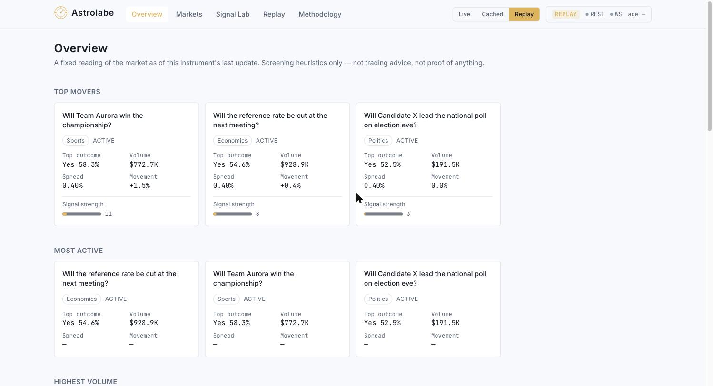
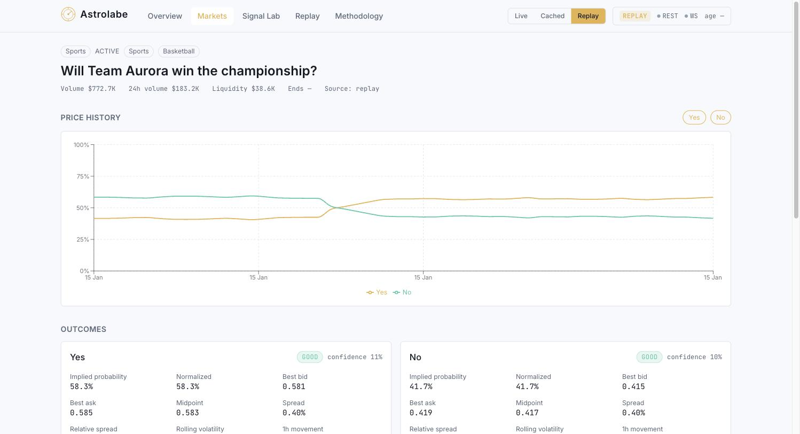
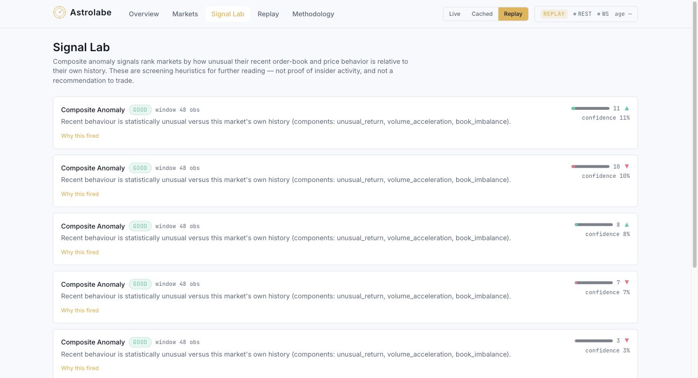

# Astrolabe

A read-only research instrument for prediction markets — fixing a market's implied
probability, order-book microstructure and movement anomalies from public Polymarket data.





> Screenshots above are placeholders (`docs/screenshots/*.png` not yet captured) — see
> [Preview](#preview) for a text description of each surface.

**Live demo:** Not yet deployed — see [`docs/deployment.md`](docs/deployment.md).
**Repository:** `<repository-url-placeholder>`

---

## Disclaimer

Astrolabe is a **read-only research and screening tool**. It is not a betting site, does not
place trades, and holds no wallet or exchange credentials. The signals it computes are
**statistical screening heuristics** — they flag behaviour that is unusual relative to a
market's own recent history. They are **not evidence of insider trading**, **not a
calibrated forecast**, and **not a claim of profitability or validated predictive alpha**.
See [`docs/limitations.md`](docs/limitations.md) for the full list of caveats.

## Preview

Astrolabe's frontend (Next.js) has five surfaces, all driven by the same FastAPI backend:

- **Overview** (`/`) — top movers, most active, highest volume and widest-spread markets,
  plus a feed of the strongest recent signals.
- **Markets** (`/markets`) — a searchable, filterable, sortable market explorer.
- **Market detail** (`/markets/[id]`) — a single market's question, outcomes, implied
  probabilities, order-book view, price history chart, and per-outcome signals.
- **Signal Lab** (`/signals`) — the ranked list of current composite-anomaly signals across
  markets, each with its component breakdown and confidence.
- **Replay & Backtest** (`/replay`) — runs the look-ahead-safe backtest against the committed
  synthetic dataset and displays hit-rate / false-positive-rate results.

Every page shows a mode indicator (live / cached / replay) and a data-quality/degradation
banner so a viewer always knows the provenance and freshness of what they're looking at.

## Quickstart

### One command (Docker)

```bash
docker compose up --build
```

Backend on `http://localhost:8000`, frontend on `http://localhost:3000`. The compose file
builds both images, wires `NEXT_PUBLIC_API_BASE`, and waits for the backend's `/health` check
before starting the frontend.

> **Note:** `docker compose up` was **not executed** in the build environment (no Docker
> daemon was available there). The Dockerfiles and `docker-compose.yml` are authored to spec
> and validated by inspection; running them is the operator's next step. See
> [`docs/deployment.md`](docs/deployment.md) for details.

### Non-Docker quickstart

**Backend:**

```bash
cd backend
python -m venv .venv && source .venv/bin/activate
pip install -r requirements.txt
uvicorn astrolabe.api.app:app --reload
```

**Frontend** (separate terminal):

```bash
cd frontend
npm install
npm run dev
```

Backend serves `http://localhost:8000` (interactive API docs at `/docs`); frontend serves
`http://localhost:3000` and expects `NEXT_PUBLIC_API_BASE` (see `frontend/.env.example`,
defaults to `http://localhost:8000`).

This non-Docker path is the one actually exercised while building Astrolabe.

## Core features

- **Three explicit data modes** — LIVE (real Polymarket Gamma + CLOB public REST), CACHED
  (most recently ingested data from local storage), REPLAY (a committed, deterministic demo
  dataset). Every API response carries a `DataStatus` envelope stating the true mode; cached
  or replay data is never presented as live.
- **Market discovery & detail** — search/filter/sort over active markets; per-market detail
  with outcomes, implied probabilities, order book, and price history.
- **Explainable signals** — movement z-score, volatility, order-book imbalance, spread
  widening, near-mid depth shift, and a composite anomaly score, each with a visible
  component breakdown, method description, and confidence.
- **Data-quality-aware confidence** — every signal's confidence is penalised transparently
  for short history, wide spread, thin depth, stale data, and one-sided books.
- **Deterministic replay & backtest** — a committed synthetic dataset drives the exact same
  analytics code as live mode, enabling a reproducible, look-ahead-safe backtest of the
  anomaly signal.
- **Graceful fallback** — live discovery failures fall back to cached data, then to replay,
  with the reason always surfaced in the response.

## Stack

| Layer | Technology |
|---|---|
| Backend | Python 3.11, FastAPI, Pydantic v2, httpx (async REST), `websockets` (CLOB market channel), SQLAlchemy (async), NumPy/pandas |
| Storage | SQLite (default, via `aiosqlite`) or Postgres (via `asyncpg`, operator-configured) |
| Frontend | Next.js 14, TypeScript, Tailwind CSS, Recharts |

## Data modes

| Mode | Source | When used |
|---|---|---|
| `live` | Real-time public Polymarket Gamma + CLOB REST | Default; requested explicitly or when no other mode is set |
| `cached` | Most recently ingested snapshot in local storage (SQLite/Postgres) | Requested explicitly, or automatic fallback if live discovery fails and a cache exists |
| `replay` | Committed, version-controlled synthetic dataset (`backend/astrolabe/replay/dataset/scenario.json`) | Requested explicitly, or the final fallback if both live and cache are unavailable |

Pass `?mode=live|cached|replay` on any market/overview/signals endpoint to force a mode; omit
it to use the server's configured default (`DEFAULT_MODE`, live by default). The response's
`status` envelope always states the mode actually served, plus REST/WebSocket health, last
update time, data age, and — on fallback — a `degradation_reason`.

## Testing

**Backend:**

```bash
cd backend
pytest
ruff check .
```

121 backend tests pass and the repository is ruff-clean, verified by the build lead in this
environment.

**Frontend:**

```bash
cd frontend
npm run build
npm run lint
```

## Documentation

- [`docs/architecture.md`](docs/architecture.md) — system design, module boundaries, data-flow diagrams
- [`docs/methodology.md`](docs/methodology.md) — the analytics: formulas, rationale, edge cases, limitations
- [`docs/API.md`](docs/API.md) — full endpoint reference
- [`docs/deployment.md`](docs/deployment.md) — environment variables, Docker, hosting notes
- [`docs/limitations.md`](docs/limitations.md) — honest limitations and known caveats
