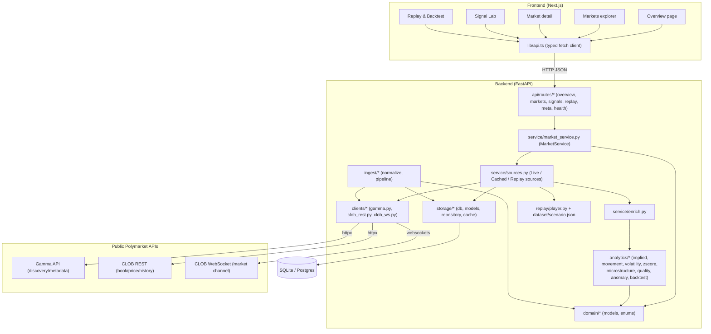
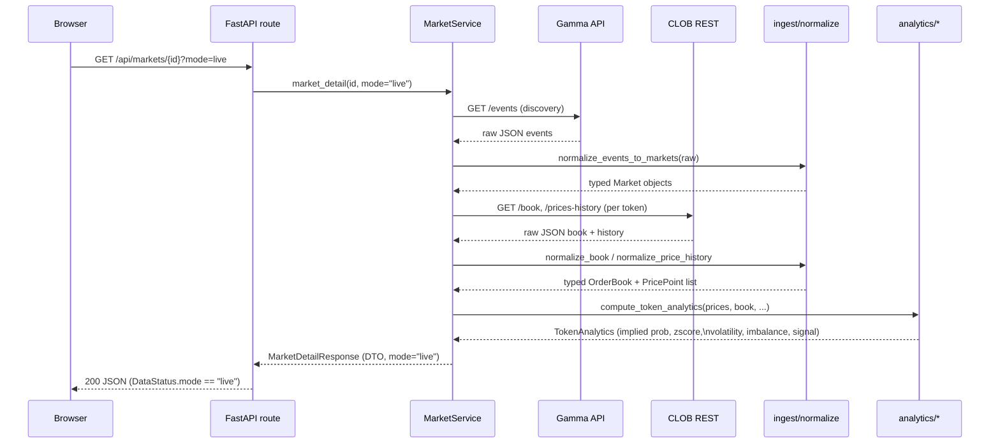
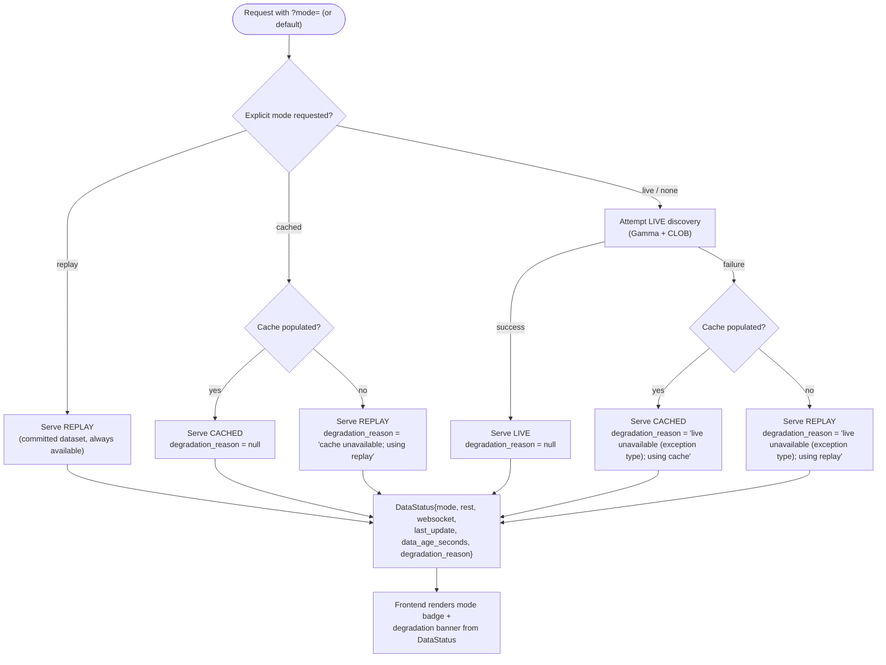

# Architecture

## Overview

Astrolabe is a two-process system: a Python/FastAPI backend that owns all data access and
analytics, and a Next.js frontend that renders the backend's typed JSON contract. The backend
is organized into strict layers so that raw third-party data, internal domain state, and the
public API contract never blur together.

```
backend/astrolabe/
  domain/        typed Pydantic models + enums (the shared internal contract)
  clients/       thin async HTTP/WebSocket wrappers around Gamma + CLOB (return raw JSON)
  ingest/        anti-corruption layer: raw JSON -> domain models; the ingestion pipeline
  storage/       SQLAlchemy async ORM + repository (cached mode's persistence)
  analytics/     pure functions: implied probability, movement, volatility, z-score,
                 microstructure, quality, composite anomaly, backtest
  replay/        deterministic dataset player (drives the same analytics as live mode)
  service/       MarketService: mode resolution, fallback, enrichment, API-response assembly
  evaluation/    prospective weekly cohort engine: selection, freeze, forward tracking,
                 resolution, portfolio simulation (isolated package, own tables)
  api/           FastAPI app, routers, dependency wiring
frontend/
  app/           Next.js route pages (overview, markets, market detail, signals, replay)
  components/    presentational + mode-aware UI components
  lib/           typed API client, formatting helpers, mode context
```

### Module boundaries

- **`clients/`** know only about HTTP/WebSocket mechanics (retries, backoff, rate-limit
  handling, typed error hierarchy). They return raw dicts/lists exactly as received from
  Gamma/CLOB and know nothing about `astrolabe.domain`.
- **`ingest/normalize.py`** is the anti-corruption layer: every raw field coming from
  Polymarket (JSON-encoded-string arrays, stringly-typed numbers, inconsistent `...Num`
  variants) is defensively parsed and coerced into typed `domain.models` objects. A single
  malformed field is dropped or coerced, never raised – a bad record does not sink ingestion.
- **`domain/models.py`** is the shared internal contract: `Market`, `Outcome`, `OrderBook`,
  `BookLevel`, `PricePoint`, `MarketSnapshot`, `Signal`, `SignalComponent`, `DataStatus`,
  `SourceHealth`. All timestamps are timezone-aware UTC; all prices are floats clamped to
  `[0, 1]`.
- **`analytics/`** is pure – no I/O, no knowledge of HTTP or storage. Every function takes
  plain values or domain models and returns a value or `None`, never raising on missing/thin
  data. This is what makes the module independently unit-testable and safe to run identically
  over live, cached, or replayed data.
- **`storage/`** persists normalized domain models via SQLAlchemy async models, translated
  to/from ORM rows exclusively in `repository.py`. No SQLite-only column types are used, so
  the same schema works against Postgres.
- **`replay/player.py`** loads a committed JSON dataset and exposes it through the *same*
  domain models as live/cached data, with strictly frame-indexed, look-ahead-safe accessors.
- **`service/market_service.py`** is the application brain: resolves which data source to
  use (with fallback), fans out per-token enrichment through `analytics/`, and assembles the
  public API response DTOs (`service/schemas.py`).
- **`api/`** is a thin FastAPI layer: routers call into `MarketService` and return its DTOs
  directly. No raw upstream JSON and no internal domain model is ever serialized to the
  frontend – only `service/schemas.py` response models cross that boundary.

### Anti-corruption layer

Polymarket's Gamma API returns several fields (`outcomes`, `outcomePrices`, `clobTokenIds`)
as JSON-encoded **strings** rather than arrays, and numeric fields inconsistently as strings
or as separate `...Num` variants. `ingest/normalize.py` is the single place this is absorbed:
`parse_json_array_string`, `safe_float`, and `_first_float` coerce or drop malformed input,
so nothing downstream of `normalize_market` / `normalize_book` / `normalize_price_history`
ever needs to know Polymarket's raw wire format. The FastAPI layer serializes only
`service/schemas.py` DTOs – raw JSON from Gamma/CLOB never reaches the frontend.

### UTC everywhere

All domain timestamps (`Market.updated_at`, `OrderBook.timestamp`, `PricePoint.t`,
`Signal.computed_at`, `DataStatus.generated_at`, etc.) are timezone-aware UTC `datetime`
objects, produced by a single `utcnow()` choke point in `domain/models.py`. Storage rows use
`DateTime(timezone=True)`; the repository re-attaches UTC tzinfo defensively on read since
SQLite does not reliably round-trip it.

### Three data modes + fallback

`DataMode` (`live | cached | replay`) is a first-class enum carried on every response's
`DataStatus` envelope, alongside `SourceHealth` for REST and WebSocket, `last_update`,
`data_age_seconds`, and an optional `degradation_reason`. `MarketService._select_source`
resolves the active mode: an explicit `?mode=` request is honored (falling back only if that
exact mode is unavailable – `cached` falls back to `replay` if no cache exists); with no
explicit request, `live` is attempted first, falling back to `cached` (if a populated cache
exists) and finally to `replay`, which is always available. The UI can never silently present
cached or replay data as live, because the mode travels with the data itself.

### Evaluation package and cohort data flow

`astrolabe.evaluation` is a self-contained package added for the prospective weekly cohort
system (`docs/methodology.md` §12). It shares the same SQLAlchemy `Base.metadata` and database
as the rest of the backend, but its eight tables (`calculation_versions`, `signal_snapshots`,
`weekly_cohorts`, `cohort_entries`, `ranking_audit`, `forward_price_observations`,
`market_resolutions`, `evaluation_results`) live in their own module, are created by their own
idempotent bootstrap (`evaluation/migrations.py`), and are never written to by the ordinary
market-data request path: only by the scheduler CLI (`evaluation/cli.py`), and read by the
`/api/cohorts/*` routes.

The data flow, end to end:

```
MarketService.enrich_markets  ->  per-token TokenAnalytics + Signal (same analytics/* code
                                   used by every other surface)
                              ->  evaluation.snapshots.build_snapshot_input
                                   (captures entry price = signal-time midpoint, best bid/ask,
                                   spread, strength, confidence, data quality, components)
                              ->  evaluation.engine.update_rankings
                                   (eligibility + deterministic tie-break; provisional top ten;
                                   one slot per market; writes weekly_cohorts + cohort_entries +
                                   ranking_audit)
                              ->  evaluation.engine.freeze_week
                                   (Sunday 23:59:59 UTC cut-off; entries become immutable)
                              ->  evaluation.tracking.collect_forward_prices /
                                  record_resolutions / evaluate_all
                                   (writes forward_price_observations, market_resolutions,
                                   evaluation_results; never mutates a frozen entry)
                              ->  evaluation.service.CohortReadService
                                   (assembles typed CohortDetail/CohortWeek/ProvenanceOut DTOs,
                                   including the portfolio simulation)
                              ->  /api/cohorts/* routes (astrolabe/api/routes/cohorts.py)
                              ->  frontend/app/replay/page.tsx (week picker, price-movement vs
                                   final-resolution views, portfolio table, provenance notices)
```

Every step after `build_snapshot_input` reads only information that was available at the
calculation timestamp it operates on; nothing later in the chain can reach back and alter an
earlier step's output once a cohort is frozen (enforced by immutability guards in
`evaluation/repository.py`, keyed on `weekly_cohorts.frozen`). The scheduler CLI
(`python -m astrolabe.evaluation.cli ...`, see `docs/deployment.md`) is the only way these
tables are written; the API surface for cohorts is read-only.

### Observability

- **Structured logs**: `observability/logging.py` configures either human-readable
  (development) or single-line JSON (`LOG_JSON=true`, production) log output. Log statements
  attach structured context via `extra={"ctx_*": ...}` keys, which the JSON formatter lifts
  into top-level fields.
- **Timing**: `api/app.py`'s `timing_middleware` measures and logs every request's latency
  and attaches it as an `X-Response-Time-ms` response header.
- **Health**: `/health` is a liveness probe (process up, returns app name/environment/time);
  `/api/status` reports the currently resolved data mode and per-source health; Docker
  healthchecks in both `backend/Dockerfile` and `docker-compose.yml` poll `/health`.
- **Error handling**: a global FastAPI exception handler logs the full exception server-side
  but returns a generic `{"error": "internal_error", ...}` body – stack traces never reach
  the client.

## Diagram 1 – Component graph



## Diagram 2 – Live-data request sequence



## Diagram 3 – Fallback behaviour



All three diagrams above are valid Mermaid (`graph TD`, `sequenceDiagram`, `flowchart TD`)
and were checked for syntactic correctness (balanced brackets, valid arrow syntax, no
unescaped special characters inside node labels).

---

## Opportunity intelligence and alerting

New packages: `analytics/flow.py` (trade-flow/wallet/timing indicators over the public Data API
`/trades`), `opportunity/` (Research Priority scoring, evidence families, tags, board service,
immutable daily snapshot storage + CLI), `alerts/` (provider-neutral email with a console sink,
eligibility, honest wording, dedup/cooldown, history, disabled by default). Search adds
`GammaClient.search` (public-search) and `ingest/aliases.py`. Data flow: enrich (price+book
signal) + Data API trades -> flow indicators -> evidence families -> Research Priority ->
Opportunity Board -> daily snapshot / alerts. Home page consumes the board; Explore Markets adds
full-universe search.
