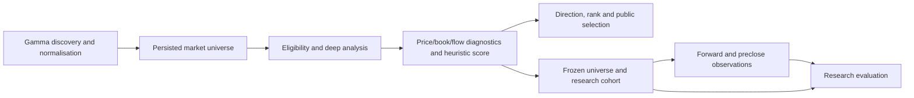
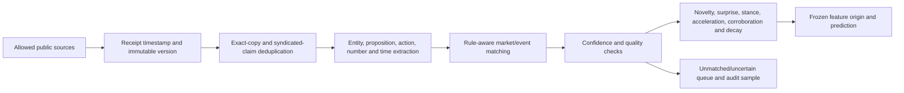
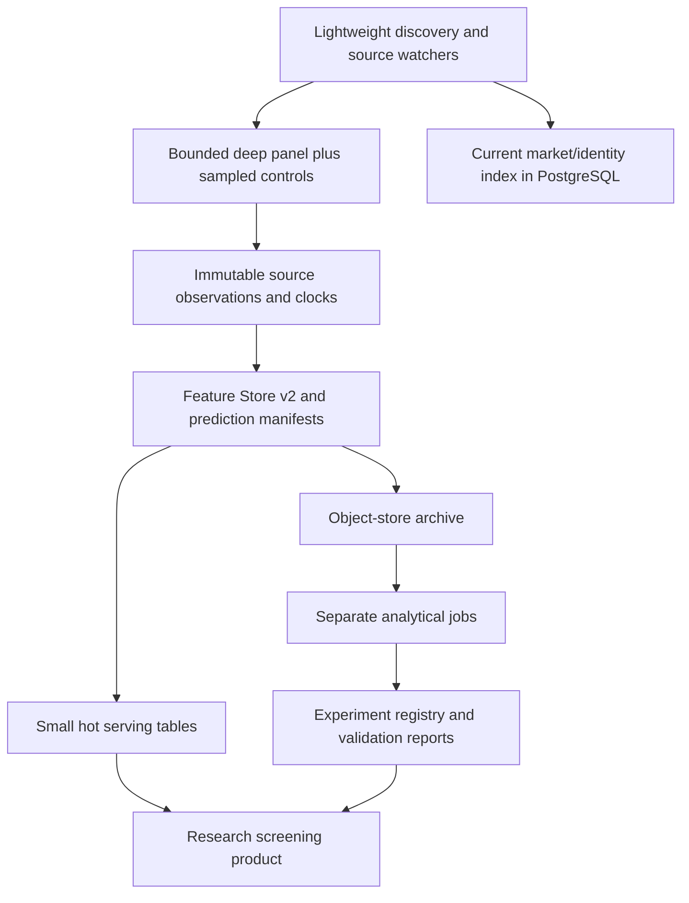

# AREPO quantitative edge-discovery research and architecture report

**Research cutoff: 19 September 2026. Scope: read-only investigation and design.** Repository, database and deployment observations below are point-in-time findings from this date, not continuously monitored status. The report and its supporting catalogues form one deliverable. No application code, repository state, database data/schema, infrastructure or collection schedule was changed. The separately requested 4am task-continuation reminder is administrative, not an AREPO production change.

## A. Executive conclusion

**AREPO has a useful foundation for an edge-discovery programme, but the inspected system and data do not establish an independent predictive edge beyond momentum.** Its current directional output follows the sign of a price z-score, and all 74,967 direction-bearing research entries matched the momentum direction in the audited query. Ranking or filtering might still add value, but that is a separate hypothesis requiring a strong baseline and an honest outcome panel.

The highest-value next research action is a **small, timestamp-faithful prospective panel** that compares momentum and a richer price/context baseline against pre-trade depth-normalised flow, persistent book imbalance and rule-matched external/related-market innovations. Include scheduled controls and independent event groups. This directly tests whether non-price information predicts *remaining* repricing after its initial impact. It also reveals whether data quality and latency are adequate before investing in expensive wallet graphs, paid social feeds or complex ensembles.

Five conclusions guide the roadmap:

1. **Preserve numerical research data first.** Feature Store v2 is specified before retention changes. Existing numerical components are valuable, despite missing families; tags and scores alone cannot support future experiments.
2. **Repair scientific measurement in the design.** All 110,209 inspected entries lack event IDs; many horizon observations are late; the quote timestamp field is assigned by the collector. These limitations affect independence and causal timing, not just engineering neatness.
3. **Search broadly but test narrowly.** The package contains 60 falsifiable experiments and 60 numerical feature definitions. Start with a small preregistered set that discriminates information from impact, stale quotes, selection and shared news.
4. **Keep modelling conditional on evidence.** Hierarchical Bayesian and boosted-tree models are challengers. The six-arm ensemble tournament includes the required simple/weighted/stacked variants; none has earned recommendation without prospective improvement over its stronger constituent.
5. **Separate prediction, screening and money.** A better-calibrated probability or a useful research alert can be valuable without yielding attainable net trading profits. Current fees, spreads, depth, latency, fills, collateral and protocol rules belong in a separate economic assessment.

The source inventory is broad and machine-readable: 223 production-host REST operation records, documented stream/SDK schemas, 29 contract addresses and inspected ABI/interface fields. Live API probes were blocked with HTTP 403, so runtime-field completeness and measured feed performance are not claimed. This limitation is recorded rather than disguised as an exhaustive live audit.

**Supporting deliverables:** [Polymarket catalogue](POLYMARKET_SOURCE_AND_FIELD_CATALOGUE.md), [external sources](EXTERNAL_SOURCE_REGISTER.md), [evidence matrix](EVIDENCE_MATRIX.md), [Feature Store v2](FEATURE_STORE_V2.md), [feature register](FEATURE_RESEARCH_REGISTER.csv), [60 experiment cards](EDGE_HYPOTHESIS_LIBRARY.md), and [model/validation protocol](MODEL_COMPARISON_AND_VALIDATION.md). Machine-readable versions are included for research planning.

## B. Verified current system, discrepancies and data capability

### State reconciliation

The repository default branch is `arepo-free-production-v1`, inspected at `e50f063d1a51a07eb32fcffeedd841b565ebca33`. The `codex/lean-research-architecture` branch was three commits ahead and zero behind at `ed099bb32828b1f46ab211e10e69e764a05bb5c5`; it is a proposal/branch implementation, not the deployed service. Render's latest live deployment identified commit `f4c82564693efd99b081ccbfcacb82790ee1fe7a` on the production branch, deployed 22 August. The newer repository head includes workflow-level changes. Raw read-only evidence is retained under `evidence/`.

The scan workflow's automatic schedule is commented out; manual dispatch remains possible. The collection workflow remains scheduled every 15 minutes, at minutes 10/25/40/55. Database scheduler records show successful forward/preclose/resolve/retention jobs on 19 September, while refresh/freeze activity last occurred on 22 August. Therefore “collection paused” needs precision: new discovery/cohort generation is paused, but collection/maintenance job records continued. A successful scheduler record alone does not prove useful new observations were produced. [Scan workflow](https://github.com/dayyansheikh/Arepo/blob/e50f063d1a51a07eb32fcffeedd841b565ebca33/.github/workflows/scheduler-scan.yml), [collection workflow](https://github.com/dayyansheikh/Arepo/blob/e50f063d1a51a07eb32fcffeedd841b565ebca33/.github/workflows/scheduler-collect.yml).

Eligibility explicitly includes a 30-day close horizon and a 20,000 liquidity floor; tradability checks exclude outcomes pinned at or beyond approximately 0.02/0.98 and require relevant market structure. The public display limit is not the same as the analysed universe. These are current policy rules, not statistically established optimal research restrictions. The price-horizon and resolution-horizon distinction makes the 30-day exclusion particularly important to test. [Eligibility source](https://github.com/dayyansheikh/Arepo/blob/e50f063d1a51a07eb32fcffeedd841b565ebca33/backend/astrolabe/discovery/eligibility.py).

The anomaly score combines unusual return (.24), movement abnormality (.20), volatility regime (.16), volume acceleration (.12), book imbalance (.12), spread change (.08) and depth change (.08), renormalising available components. Direction is the sign of the price z-score. The weights are heuristic. Existing “without book/flow” directional comparisons largely retain momentum direction; the “without momentum” path switches to book/flow fallback. This is not a learned incremental-information ablation. [Anomaly source](https://github.com/dayyansheikh/Arepo/blob/e50f063d1a51a07eb32fcffeedd841b565ebca33/backend/astrolabe/analytics/anomaly.py), [research predictors](https://github.com/dayyansheikh/Arepo/blob/e50f063d1a51a07eb32fcffeedd841b565ebca33/backend/astrolabe/evaluation/research_predictors.py).

Flow code already contains useful intermediate numbers: relative trade size, robust z-score, concentration and timing measures. Thresholds such as robust z≥3, opposing share≥0.6, three clustered large trades and the last 15% of market lifetime should become continuous research variables and development-only threshold candidates. Their existence in code does not prove complete historical capture in every cohort. [Flow source](https://github.com/dayyansheikh/Arepo/blob/e50f063d1a51a07eb32fcffeedd841b565ebca33/backend/astrolabe/analytics/flow.py).

### Audited data

Supabase `Arepo_model_1` (`wrjjgfnrlclfnspkzqpu`, eu-west-2) was active/healthy. Exact database size was 997,084,307 bytes: 997.1 decimal MB or 950.9 MiB. Table totals include indexes; row estimates must not be confused with exact counts.

| Finding | Verified observation | Research implication |
|---|---|---|
| Research origins | 58 cohorts: 56 six-hour, one daily, one weekly | Daily and weekly share an origin and 2,766 entries each; do not treat them as independent replications. |
| Observation span | Six-hour origins 6–22 August 2026 | Approximately 16 days cannot establish broad regime stability. |
| Entries and identities | 110,209 entries; 33,035 distinct markets; all labelled prospective; no missing condition IDs; **zero populated entry event IDs** | Provenance label alone does not establish clean feature/label timing or event independence. |
| Quotes at origin | 110,071 two-sided; depth present in 110,203 | High field presence is encouraging but does not establish freshness or complete book history. |
| Direction | 74,967 direction-bearing entries match momentum | Current direction is not an independent non-price predictor. |
| Book imbalance raw values | 110,193 present | Potential exploratory input, with clock/selection caveats. |
| Other raw components | Movement abnormality 97,823; unusual return 87,437; volatility regime 96,319 | Preserve values and missingness; model on identical panels. |
| Universally absent raw components | Volume acceleration, spread change, depth change: zero present | Cannot evaluate their historical contribution from these component records. |
| Storage concentration | Discovery snapshots 626.4 MB; entries 174.3 MB; forward observations 92.2 MB; market table 88.5 MB | Repeated research payloads dominate; preserve before considering physical compaction. |

Source queries and responses: `evidence/db_entries.json`, `db_cohorts.json`, `db_component_coverage.json`, `db_sizes.json`, `db_direction.json`. These are bounded read-only aggregates, not a full data export.

| Horizon | Usable midpoint observations | Flagged exact (existing 15-minute tolerance) | Median recorded delay | 95th-percentile delay |
|---|---:|---:|---:|---:|
| 1 hour | 100,725 | 13,265 | 55.8 min | 196.5 min |
| 6 hours | 76,906 | 8,909 | 55.3 min | 195.6 min |
| 24 hours | 40,129 | 12,829 | 41.0 min | 187.9 min |
| 7 days | 6,498 | 1,182 | 48.0 min | 18.36 hours |

“Usable” here means non-null midpoint and no unavailable reason in the audit query, not that the quote meets the new scientific timing standard. The stored `exact` tolerance is 900 seconds; the table counts that stored flag rather than independently certifying source-clock alignment. Moreover, `quote_from_book` assigns its source timestamp using the collector clock. The table therefore measures recorded collection timing, not verified exchange-event latency. [Tracking](https://github.com/dayyansheikh/Arepo/blob/e50f063d1a51a07eb32fcffeedd841b565ebca33/backend/astrolabe/evaluation/research_tracking.py), [constants](https://github.com/dayyansheikh/Arepo/blob/e50f063d1a51a07eb32fcffeedd841b565ebca33/backend/astrolabe/evaluation/research_constants.py), `evidence/db_horizon_summary.json`.

### Discrepancy register

| Claim or assumption | Audit verdict | Consequence |
|---|---|---|
| AREPO direction adds book/flow information beyond momentum | Contradicted for current directional construction and audited direction-bearing entries | Test non-price features against price/context baseline using newly defined models. |
| All collection is stopped | Too broad | Discovery/freeze paused; scheduler collection/maintenance still recorded activity. |
| Lean branch is production | Not supported | Keep branch proposals separate from live behaviour. |
| Twelve-hour cohort cadence equals refresh timing | False equivalence | A freeze cadence, a scan refresh gate and quote collection frequency serve different purposes. |
| “Exact” outcomes are exact-horizon prices | Misleading terminology | Preserve actual delay; stricter targets need different measurement. |
| Source timestamp proves venue event time | Not for the inspected quote path | Separate collector/source clocks prospectively. |
| Existing features retain only tags | Too pessimistic | Raw component and flow intermediates exist; audit and preserve them. |
| Seven advertised components can all be tested | Not supported by raw component coverage | Three components are absent throughout the audited entries. |
| Polymarket fees can be universally zero | Outdated | Current fee configuration must enter economic tests. |
| More than 100k rows imply strong effective sample size | Unsupported | Repeated/related markets and short calendar span require event/time grouping. |

Existing data can support provenance/coverage diagnostics, reconstruction feasibility, current-score versus momentum **exploratory ranking** comparisons, and selected numerical feature sanity checks. It cannot alone support precise fast-horizon claims, novel absent-feature tests, historical wallet-state/text experiments, or a credible prospective superiority claim for a model fitted after inspecting it. No backtest performance numbers are manufactured in this report.

## C. Prediction-market literature

Foundational research supports prediction markets as information-aggregation mechanisms in some settings, with design and participant incentives affecting performance. That supports using market probability as a demanding final-resolution baseline; it does not establish a mechanical strategy for forecasting its next price change. [Wolfers–Zitzewitz](https://doi.org/10.3386/w10504), [laboratory review](https://doi.org/10.1111/joes.12015), [theory/evidence review](https://doi.org/10.1016/j.ijforecast.2018.11.001).

Recent Polymarket research is useful but heterogeneous. Historical arbitrage studies report extracted opportunities, whereas a dense NBA book study found few short-lived in-game binary opportunities and excluded misleading post-game episodes. These results need not conflict: populations, payoff relationships, execution assumptions and protocols differ. An August 2026 study further distinguishes terminal-payoff identities from conversions executable before settlement. Thus H36–H38 require full rules, depth, fees and conversion-path checks rather than a sum-of-prices screenshot. [Historical arbitrage](https://arxiv.org/abs/2508.03474), [NBA study](https://arxiv.org/abs/2605.00864), [executable arbitrage](https://arxiv.org/abs/2608.00666).

Calibration research suggests domain/horizon heterogeneity and does not support treating every large trade as informed. The OpenMarket benchmark is especially instructive: its reported headline discrimination did not translate into beating the market prior or positive cost-adjusted simulated performance. That is evidence to strengthen baselines and timing, not evidence that every AREPO hypothesis must fail. [Calibration dynamics](https://arxiv.org/abs/2602.19520), [OpenMarket and reproducible material](https://github.com/gregyoung14/openmarket).

The evidence matrix distinguishes preprints from established methods and records inspection depth. Several papers were available only as abstracts/excerpts; effect sizes not inspected are not asserted. No formal meta-analysis or exhaustive systematic-review claim is made.

## D. Financial microstructure literature

The most transferable mechanism is the relationship between order flow, depth, adverse selection and short-run price formation. Yet contemporaneous impact is easier to explain than future continuation. Queue imbalance has demonstrated next-tick predictive value in equities, while multi-level/cross-asset order-flow studies suggest useful extensions. AREPO should test these at appropriately short horizons with source clocks and pre-trade books, then determine whether anything survives at 15 minutes or an hour. [Order-book events](https://doi.org/10.1093/jjfinec/nbt003), [queue imbalance](https://doi.org/10.1142/S2382626616500064), [cross-impact](https://arxiv.org/abs/2112.13213).

Depth-normalised trade size, withdrawal, resiliency and persistence are stronger initial research candidates than an absolute “whale” threshold because they describe the market's ability to absorb flow. The mechanism can produce either continuation or reversal: informed accumulation may continue, while temporary liquidity demand may reverse. H02, H10, H24 and H28 explicitly separate those cases. Spread and adverse-selection theory explain why apparent forecast gains may be consumed by execution costs. [Glosten–Milgrom](https://doi.org/10.1016/0304-405X(85)90044-3), [dynamic-flow execution](https://doi.org/10.1137/140992254).

Hawkes processes and graph models are optional later challengers. Simple counts, interarrival dispersion, signed-flow autocorrelation and receipt-batching controls should establish an interpretable residual first. [Hawkes survey](https://arxiv.org/abs/1502.04592).

## E. Alternative-data literature

Text research motivates novelty, attention, source independence and delayed response, not merely positive/negative sentiment. Equity evidence on stale news and reversal suggests a direct falsifiable test: does first-seen, proposition-relevant novelty add beyond the price movement already observed? A social/prediction-market case study motivates independent corroboration, but one event cannot establish a universal response law. [Stale information](https://doi.org/10.1093/rfs/hhq141), [media sentiment](https://doi.org/10.1111/j.1540-6261.2007.01232.x), [social information efficiency](https://doi.org/10.1111/kykl.12119).

Search attention is a candidate for activity or volatility as much as direction. Official-source surprise should be prioritised where the proposition is precise: CPI, a policy decision, a company filing or a weather threshold. A surprise is meaningful only relative to a prerelease expectation and an unrevised first release. This design is more informative than letting a language model retrospectively label articles “bullish”. [Attention research](https://doi.org/10.1111/j.1540-6261.2011.01679.x), [FRED real-time periods](https://fred.stlouisfed.org/docs/api/fred/realtime_period.html).

## F. Polymarket inventory and its limits

The [dedicated catalogue](POLYMARKET_SOURCE_AND_FIELD_CATALOGUE.md) is the authoritative inventory deliverable. It retains REST operations, nested schema fields/references, stream messages, SDK types, public chain/oracle structures, control/authenticated surfaces, deprecated sources and unresolved coverage. Current Data API v2 and current exchange/collateral changes were included rather than relying on earlier Gamma/CLOB assumptions. No field was excluded merely because its predictive relevance was uncertain.

Important current-state implications are the v1/v2 protocol distinction, per-market fees, exact decimal values, cursor-based v2 history, separate public and private trade sources, and rule-specific Chainlink TWAP references. Any historical dataset ending at the v1 exchange cutoff must be evaluated as a different protocol era. Current API documentation is not evidence that AREPO already collected those fields. [Current changelog](https://docs.polymarket.com/changelog/predictions), [contracts](https://docs.polymarket.com/resources/contracts), [Data API guide](https://docs.polymarket.com/api-reference/data-api/migrating-from-v1).

## G. External-data inventory and value per cost

The [24-family external register](EXTERNAL_SOURCE_REGISTER.md) covers other prediction/betting venues, crypto spot/options, licensed futures, macro vintages/releases, central-bank material, energy, company filings, parliamentary records, weather, news, X, Truth Social, Reddit, Google Trends, Wikimedia attention, research archives and public blockchain/oracle data.

Prioritise sources by **incremental information gained per total acquisition/cleaning/rights/latency cost**, measured in a controlled experiment. Begin with official releases, existing public venue/reference feeds and open historical benchmark data. Paid social coverage should be a bounded experimental treatment, not a platform-wide default. Current X documentation prices post reads at $0.005 each; 100,000 billable reads are about $500 before other resource types. Google Trends API remains an early-access alpha in the inspected documentation. [X pricing](https://docs.x.com/x-api/getting-started/pricing), [Trends API](https://developers.google.com/search/apis/trends).

Public visibility is not a licence for automated collection or redistribution. Truth Social's inspected terms restrict unauthorised automated access; Reddit commercial API use may require agreement; exchange data and full news articles have distinct entitlements. Do not conflate Polymarket International with Polymarket US or infer access rights from this user's location. API 403s were not bypassed. The next operational design must maintain a source-rights register and confirm the exact intended use, without turning this research into an ungrounded legal conclusion. [Truth Social terms](https://help.truthsocial.com/legal/terms-of-service/), [Reddit API terms](https://redditinc.com/policies/data-api-terms), [Polymarket terms](https://polymarket.com/tos).

## H. Feature Research Register

The [60-row numerical register](FEATURE_RESEARCH_REGISTER.csv) records formulas, primitive inputs, availability, transformations, missingness, evidence, confounders, interactions, current-data feasibility and falsification links. It includes raw price paths and context, book shape/flow/persistence, signed trades, wallet state, related prices, official surprises, novelty/corroboration/attention, incentives and resolution processes.

Prefer continuous predictors and smooth nonlinearities over hardcoded “large”, “late” or category exclusions. Preserve raw numerator and denominator: a ratio alone cannot show whether a signal came from larger flow or vanishing depth. Preserve source/receipt time and uncertainty: a feature is unavailable until its last required input has arrived. Definitions such as microprice overlap algebraically with imbalance and spread, so test against their joint baseline rather than counting equivalent representations as independent evidence.

Feature availability is not established by a catalogue entry. The current database supports some exploratory primitives, but most dynamic book, wallet and text candidates require prospective or explicitly reconstructed data. Existing zero coverage for three anomaly components is a specific collection gap, not a reason to abandon the hypotheses.

## I. Edge Hypothesis Library and first research portfolio

The [full library](EDGE_HYPOTHESIS_LIBRARY.md) contains 60 distinct candidates, with machine-readable [experiment cards](EDGE_EXPERIMENTS.csv). Every card specifies null, target/horizon, population, controls, baseline, confounders, test, event-level sample planning, falsification, dependencies and effort. All 22 priority mechanisms from the master brief are included. Status for all is **designed, not executed**.

| Stage | Experiments | Question resolved |
|---|---|---|
| Measurement pilot | H57 plus clock, duplicate, stale-quote and future-shift placebos | Can measured information and outcomes support the intended horizon? |
| Core book/flow | H02, H08, H09, H10, H24, H28 | Does liquidity/flow forecast remaining movement beyond momentum and context, or merely explain impact? |
| Cross-market/rule-aware | H14, H15, H36, H38, H44 | Does a matched external signal lead after realistic delay and rule alignment? |
| Low-cost information | H16, H17, H19, H20, H45, H47 | Do novelty, official surprise and corroboration contribute beyond prices? |
| Historical wallet layer | H05, H06, H07, H13, H34 | Does historical as-of skill or concentration improve flow interpretation? |
| Expensive interactions | H21, H22, H35, H49, H55 | Do social/graph/interaction features justify their cost and sample complexity? |

Run a small fixed confirmation subset, not all 60 optimised against one holdout. Expected information gain is highest when a result can eliminate a major explanation: pre-trade versus post-trade depth, source-time versus receipt-time alignment, first news versus syndicated copies, and wallet skill versus late-entry probability. Null results should reduce scope or redirect horizons; they should not be reframed as hidden success.

## J. Bayesian architecture

Use hierarchical multinomial repricing models with partial pooling by horizon and economically justified regimes; use heavy-tailed continuous-return and separate final-resolution models. Standardised feature priors, interaction shrinkage, prior-predictive checks and group-level uncertainty are specified in the [model protocol](MODEL_COMPARISON_AND_VALIDATION.md). Market probability is an offset/prior for resolution, not a substitute for a repricing target.

Wallet skill should shrink toward a population/domain prior based on mature historical labels and price-adjusted performance. A high win rate from entering near-certain outcomes is not evidence of forecasting skill. Posterior uncertainty should reflect limited independent events and sensitivity to priors. Online Bayesian updates are a later controlled experiment using only labels available at the update time. [Shrinkage research](https://doi.org/10.1214/17-EJS1337SI), [workflow](https://arxiv.org/abs/2011.01808).

## K. Machine-learning architecture

The principal nonlinear challenger should be a budgeted tabular gradient-boosted model, preceded by regularised regression/GAM. All feature transforms, encoding, selection and calibration occur inside forward/grouped development folds. Tree importance or explanatory attributions are diagnostic, not causal proof. Deep sequence/text/graph models are deferred until simpler models leave a stable residual and data support their complexity. [XGBoost](https://arxiv.org/abs/1603.02754), [LightGBM](https://papers.nips.cc/paper/2017/hash/6449f44a102fde848669bdd9eb6b76fa-Abstract.html).

Model selection must report missingness, eligible coverage, proper scores, calibration and regime stability. A challenger cannot win by abstaining on hard cases unless a matched-coverage selective-risk test also wins. Drift monitoring includes source changes, delayed labels and collection policy, not only feature histograms.

## L. Bayesian/ML ensemble architecture

Compare Bayesian alone, strongest development-selected ML alone, fixed 50/50 probability averaging, validation-estimated weighted averaging, out-of-fold stacking and—only if justified—a regime-dependent mixture of experts. They use identical future origin IDs, target definitions, horizons and event-grouped periods. Weights, calibration and gates are frozen before final confirmation.

The proposed gate requires a prespecified useful improvement over the stronger constituent, cluster-aware simultaneous uncertainty, calibration protection and consistency across future blocks. The protocol proposes a 1% relative Brier improvement as a starting utility threshold to freeze before confirmation; it is not an established AREPO optimum. **No ensemble is recommended for deployment now.** If no combination beats the stronger constituent prospectively, keep that constituent. [Stacking](https://doi.org/10.1214/17-BA1091), [combination-weight uncertainty](https://doi.org/10.3390/econometrics7030039).

## M. Model-agreement framework

Record agreement, each model's probability distribution, posterior uncertainty where applicable, data quality and applicability separately. Two models can agree because both use momentum or share a stale source. Disagreement can indicate regime sensitivity, calibration mismatch, missing inputs or genuine predictive uncertainty; H60 tests whether it predicts errors and improves abstention.

Future user output should show the horizon, probability of up/flat/down, likely movement range, evidence availability and whether a forecast falls inside a validated regime. Explain numerical drivers with links to source observations and examples from the validated population. Do not label an observation “high confidence” merely because models agree, or imply that an anomaly identifies insider trading.

## N. Wallet research architecture

Build public wallet state as of t from trades, transfers, splits/merges/redemptions and current-to-historical reconciliation. Retain unassigned flow, protocol roles and coverage start. Address creation, first observed trade and first appearance in the available archive are different facts. Market-maker, arbitrage and directional behaviour may overlap; a hard identity label is usually unjustified.

Historical skill should compare the wallet's entries against the contemporaneous market probability and relevant risk/cost baseline, with labels matured before t. Maintain category-specific and pooled posteriors; test transfer separately. Track history count, exposure, uncertainty, late-entry fraction, concentration and realised/unrealised definitions. Do not rank by current P&L and then backtest those selected winners. [Attribution limitations](https://arxiv.org/abs/2605.11640), [skill versus information-leakage distinction](https://arxiv.org/abs/2605.02287).

Public co-trading graphs are allowed research inputs, but shared timing or funding is not proof of shared real-world ownership. H35 uses past-only behavioural links with shuffled-graph controls. On-chain fills omit unfilled orders and private hedges; current leaderboards cannot substitute for historical state. [v1 database](https://arxiv.org/abs/2606.04217).

## O. Information Event Engine

The engine should turn public information into an auditable numerical observation rather than a retrospective narrative.

**Observation.** Save source URL/native ID, permitted content or content hash, publication/modified times, first receipt, response metadata, extraction availability and revision lineage. Preserve the publisher's claim separately from AREPO's interpretation. A search engine's current index can discover an old article but cannot establish that a historical model saw it then.

**Extraction.** Extract entities with aliases, proposition, action, numbers/units, event occurrence time, scheduled time, quoted speaker, negation, uncertainty and original-source attribution. Use deterministic parsers for structured releases and numbers; use an LLM where the task is genuinely semantic. Store extraction model/version, prompt hash, temperature/configuration, raw structured output, confidence and error flags. Treat source text as untrusted content, never instructions for the research agent or collector.

**Matching.** A market match needs the same entity, event predicate, date/window, location, threshold and resolution rule. Embedding similarity alone is insufficient: “wins nomination” and “wins election” are different propositions. Maintain many-to-many links with confidence and mapping provenance. Require human review for a stratified sample and ambiguous high-impact cases; do not silently force a match for every article.

**Deduplication.** Use document hashes, URL canonicalisation, text overlap and semantic claim clusters. Distinguish repeated publication, a new source independently confirming the same fact, and genuinely new detail. Model source-lineage graphs so wire-service syndication does not inflate corroboration. Keep duplicate counts as an attention feature, but separate them from independent evidence counts.

**Quantification.** Store article/claim/author counts and denominators, exact extracted values, prerelease expectations, standardised surprises, stance probabilities, novelty distances, disagreement entropy, independent-source counts, source credibility posteriors and ages/decay weights. Credibility must use only past evaluated claims and shrink sparse sources. General emotional sentiment is secondary to proposition-specific stance and factual surprise.

**Quality.** Construct a blinded, stratified human-labelled set spanning domains, languages, negation, corrected reports, reused articles, ambiguous dates and near-duplicate events. Measure entity/match precision and recall, numeric/unit exactness, date correctness, claim deduplication and latency. Proposed initial gate: ≥95% precision for automatically admitted market links and numeric/time fields in the audited pilot, with uncertainty intervals; lower-confidence items remain research-only. This target is a design choice. Extraction accuracy is necessary but insufficient: H16–H22/H45–H54 still need predictive validation.

**LLM leakage.** A contemporary model may know the historical outcome even when a prompt contains an old article. Offline historical LLM forecasts are therefore reconstructed and potentially contaminated. Prefer frozen prospective extraction, evidence-constrained structured tasks, masked future-identifying cues where feasible, and comparison with deterministic/lexical baselines. Store raw evidence and outputs so model changes can be tested without rewriting the original forecast. No amount of “as of date” prompting proves absence of historical knowledge leakage.

**Latency and cost.** Batch nonurgent extraction, cache immutable document versions, reserve expensive reasoning for uncertain proposition matches and record when the result became available. A five-minute extraction pipeline cannot support a one-minute edge claim. Evaluate cheap parser/embedding/LLM variants on the same documents and forecasts; retain the cheapest method that preserves quality and predictive performance. Provider token costs must use a chosen model's current official pricing before procurement; this report does not invent an LLM bill.

## P. Market applicability

Represent probability, liquidity, spread, age, time to underlying information, time to close, category and information intensity separately. A six-month contract can reprice predictably in six hours; a near-resolution contract can already reflect a known outcome. Test the current 30-day/20,000-liquidity/pinned-price policies as sampling alternatives, retaining a broad control population.

Applicability has three stages: source/quote validity, distributional support, and demonstrated performance in the relevant regime. Abstention can mean invalid data, insufficient evidence or little expected movement; these should not be conflated. Estimate regime effects with partial pooling and continuous interactions before proposing permanent category exclusions. H39–H43 explicitly test these choices.

## Q. Outcome definitions

The protocol specifies seven target families: three-class material direction, continuous/magnitude changes, time to move, excursions/execution, final resolution, data quality and forecast error. Distinguish midpoint from last trade and use bid/ask-depth outcomes for economic tests. Retain flat outcomes and all censoring reasons.

Existing 1h/6h/24h/7d horizons are useful comparators, but book/flow mechanisms often justify 1m/5m/15m tests. Measurement must match the hypothesis. Fixed sampling twice daily can support slow origin panels; it cannot replace continuous or dense-window monitoring for microstructure and first-passage labels. Thresholds are selected in development, saved with versions and then frozen.

## R. Validation methodology

Use expanding chronological folds, purging by actual label-availability intervals, conservative economic-event groups and an untouched future confirmation panel. Report both existing-event continuation and unseen-event generalisation. Sampling controls, missing outcomes, source outages and regime concentration belong in the analysis, not just in an appendix.

The 60-card programme is a discovery set. Record all attempted specifications and use family-level multiple-testing treatment before a small confirmatory set. Cluster-level paired proper-loss variance determines sample size; raw row count does not. A small p-value after many adaptive trials is not an edge. Bayesian certainty does not remove selection bias. [Backtest overfitting](https://doi.org/10.21314/JCF.2016.322), [FDR](https://doi.org/10.1111/j.2517-6161.1995.tb02031.x).

## S. Ablation programme

For every finalist compare baseline only, baseline plus one feature family, full model and full model minus that family. Include price-only/context-only, book-only, flow-only, wallet-without-current-P&L, text-without-sentiment, novelty-without-volume, and timing/missingness-only controls. Test interactions against both constituent main effects.

Use the same common panel first; then report practical missing-data coverage on the broader panel. Permutation must respect event/time structure. When correlated variables substitute for one another, leave-one-variable-out importance can be misleading; family ablation and mechanism-specific comparisons are required. Existing direction-preserving code variants are retained as historical baselines, not presented as this ablation programme.

## T. Calibration framework

Proper scores, reliability plots, calibration slope/intercept, class-wise diagnostics and event-aware uncertainty accompany discrimination. Fit calibration inside development folds and preserve pre/post-calibration predictions. Sparse regimes need pooling rather than many unstable reliability bins. Log loss penalises confident errors; Brier captures probability accuracy; neither alone guarantees economic value. [Proper scores](https://doi.org/10.1198/016214506000001437), [calibration](https://arxiv.org/abs/1706.04599).

## U. Ranking and product usefulness

Measure material-move and directional precision@K separately, lift over the eligible population, recall, coverage, event concentration, ranking stability and turnover. K should reflect a user's review capacity and be frozen before confirmation. Compare against absolute momentum, current AREPO, simple volume/liquidity and random eligible selection.

For a research product, test whether users find relevant evidence sooner, whether alerts identify developments they would otherwise miss, and whether the system explains uncertainty accurately. This is a separate product study; a better screen need not be marketed as profitable trading. Future output can say “research signal; validated in these regimes; probability and horizon; principal numerical evidence; missing sources; model disagreement,” with historical example links and no unsupported certainty.

## V. Storage architecture and Feature Store v2

[Feature Store v2](FEATURE_STORE_V2.md) is a first-class specification: identities and event grouping, source/receipt/cutoff clocks, exact numerical inputs/intermediates, schema/feature/parser/model versions, explicit missingness, immutable predictions, separate labels/revisions, provenance classes and archive-equivalence acceptance. It precedes every retention recommendation.

Use PostgreSQL/Supabase for current market indexes, identities, manifests, job state and bounded serving queries. Use object-store Parquet for immutable numerical observations, registered source windows and historical research panels. Query locally or on separate analytical compute with DuckDB/Polars before adopting a larger warehouse. Google Sheets can review a small experiment/status summary; it is unsuitable as the authoritative causal feature store. [DuckDB](https://duckdb.org/docs/stable/data/parquet/overview), [Polars](https://docs.pola.rs/user-guide/io/multiple/).

A lightweight watcher should track lifecycle/metadata changes and cheap price/activity triggers. Deep collection follows the registered universe and sampled controls, not only the top-ranked markets. Targeted outcome collection should schedule only due observations while retaining unavailability/censoring records. Collecting everything globally is not necessary for a strong first experiment; dropping controls to save storage can destroy interpretability.

Archive equivalence requires exact identity/time/missingness/cohort/outcome linkage, numerical precision tests, feature and baseline-prediction replay, and independent restoration. Compression cannot recover source timestamps or never-collected sequences. **No deletion or shorter retention is recommended before those acceptance tests pass.**

## W. Infrastructure and access-control assessment

The service was on Render Free with 512 MB RAM. The inspected market service loads the persisted universe into an in-process cache with a 60-second lifetime; a growing market table can therefore impose memory and query/egress costs. This is a supported architectural risk, not a newly measured out-of-memory diagnosis. Historical handover outage claims were not independently established from a complete incident-log review in this task. [Market service](https://github.com/dayyansheikh/Arepo/blob/e50f063d1a51a07eb32fcffeedd841b565ebca33/backend/astrolabe/service/market_service.py), [Render compute plans](https://render.com/docs/compute-plans).

Design database-side filtering/keyset pagination and a small current-market index, bounded caches, selective columns, batch requests and analytical workloads outside the serving process. Measure query plans, payload bytes, peak memory and cache-hit ratios on a representative read-only replay before choosing compute. A paid plan with the same RAM does not solve a memory-bound design. Do not infer that the older “Starter” name means more memory after Render's plan-name changes.

Supabase role-grant inspection found broad privileges for `anon`/`authenticated` across the audited public tables; RLS was disabled on 26 of 33 tables. Seven account-related tables had RLS enabled, and the security advisor reported missing-policy informational items there. **Actual unauthenticated exposure was not demonstrated:** the Data API's exposed-schema configuration and network/credential path were not verified, and no unauthenticated write test was attempted. Treat this as a conditional access-control concern requiring a later authorised configuration review, not a confirmed exploit. Evidence: `db_grants.json`, `db_security.json`, `db_schema.json`.

Recommended future design separates public serving views from immutable research tables, uses least-privilege read-only research roles and makes migrations explicit. Current workflows/build paths include automatic migration behaviour, which is why this audit did not run application commands that might write. A payment upgrade does not fix access grants, timing or provenance.

## X. Cost model and sizing

Prices were checked against primary sources on 19 September 2026. Dollar amounts below are USD, exclude tax and researcher labour, and are scenarios rather than measured bills. Compression factors, traffic and compute utilisation remain benchmark inputs.

**Current documented anchors:** Supabase Pro starts at $25/month with 8 GB disk per project and $10 compute credit covering one Micro instance; usage beyond included allowances and additional compute/projects can add costs. Free includes a 500 MB database allowance, which is below the inspected 997.1 MB physical database size; this does not itself establish the project's billing plan or enforcement state. R2 Standard storage is $0.015/GB-month with separate operation pricing and free Internet egress under the documented terms. [Supabase pricing](https://supabase.com/pricing), [egress accounting](https://supabase.com/docs/guides/platform/manage-your-usage/egress), [R2 pricing](https://developers.cloudflare.com/r2/pricing/).

| Scenario | Explicit workload assumption | Raw numerical volume | Indicative object storage at $0.015/GB-month, before free tier/rounding |
|---|---|---:|---:|
| Sparse origin panel | 2,000 markets × 2 origins/day × 2 KB/row | 8 MB/day; 0.24 GB/month | One month's retained data ≈$0.004/month; 12 months ≈$0.043/month |
| Targeted minute panel | 500 markets × 1,440 rows/day × 1 KB/row | 0.72 GB/day; 21.6 GB/month | One month ≈$0.32/month; 12 months ≈$3.89/month |
| Broad second-level panel | 2,000 markets × 86,400 rows/day × 2 KB/row | 345.6 GB/day; 10.37 TB/month | One month ≈$155.52/month; 12 months ≈$1,866/month |

These estimates exclude multi-level books, delta events, raw text, indexes, replicas, backups, metadata and query intermediates. If two tokens per market are stored independently, multiply accordingly. Real stream event rates can exceed periodic snapshot rates. Permanent retention makes storage cumulative. Parquet compression should be measured on representative data rather than assumed; files should be batched to avoid one object operation per row.

R2 Standard operation anchors are $4.50 per million Class A and $0.36 per million Class B operations, with a documented monthly free tier. At 1,000 batched writes/day the raw operation rate is 30,000/month; at 720,000 writes/day it becomes 21.6 million/month and can dwarf the storage cost of the same rows. Compute, not storage, may dominate repeated wide scans. [R2 pricing](https://developers.cloudflare.com/r2/pricing/).

| Budget envelope | Components | Planning range/month |
|---|---|---:|
| Initial controlled research panel | One Supabase Pro/Micro planning baseline $25; collector/analytics allowance $25–100; small archive/monitoring allowance $0–25; free/allowed public sources | $50–150 |
| Larger book/flow and wallet pilot | Database $25–75 allowance; collectors/analytics $75–250; archive/RPC/monitoring $25–150 | $125–475 |
| Bounded social/text treatment | Above plus 20k–100k billable X post reads ($100–500), chosen-model extraction budget and any content licence | Add $100–500 plus unpriced extraction/licensing |

Only named provider anchors are verified prices; compute/RPC/monitoring ranges are explicit planning allowances, not Render/vendor quotations. Render's dynamic pricing page did not expose a reliable complete price table to the text inspection, so this report does not invent a current $7/$25 service quote. Obtain a current configuration-specific quote after memory/throughput measurements. [Render pricing](https://render.com/pricing).

Database egress should be estimated as result bytes × query frequency × clients/jobs, distinguishing cached and uncached billing. A 20 MB result every minute is about 864 GB over 30 days; returning 200 KB instead reduces that to about 8.64 GB. These are arithmetic illustrations, not measured AREPO traffic. Targeted SQL, bounded result sets and batch analytical exports can matter more than marginal storage compression. Paid data spending should continue only if a preregistered incremental test justifies it.

## Y. Product, open-source and moat assessment

Public field access and an attractive whale dashboard are weak differentiators on their own. Hashdive advertises market statistics, AI probability comparisons and wallet scoring; Polywhaler offers large-trade feeds, profiles, alerts, charts and paid developer access; Polymarket Analytics advertises market/wallet history and leaderboards. The inspected product pages do not provide sufficient independent, prospectively timestamped, cost-adjusted evidence to adopt their performance claims as research findings. [Hashdive](https://hashdive.com/), [Polywhaler documentation](https://polywhaler.com/docs), [Polymarket Analytics](https://polymarketanalytics.com/).

Useful open material includes official schemas/SDKs and contract sources for semantics, pmxt for adapter concepts and its archive for potential history, OpenMarket for synchronisation and a demanding negative benchmark, and PrediBench for live-agent evaluation ideas. Audit licences, clock quality, sample selection, market-prior baselines, fees and reproducibility before reuse. A project's claim that live evaluation cannot overfit is too strong if researchers repeatedly choose strategies after seeing results. [pmxt](https://github.com/pmxt-dev/pmxt), [archive](https://archive.pmxt.dev/), [OpenMarket](https://github.com/gregyoung14/openmarket), [PrediBench](https://github.com/PresageLabs/PrediBench).

A defensible AREPO advantage could be a high-quality prospective dataset with documented first availability, a versioned event/rule graph, an honest library of failed and successful mechanisms, calibrated regime-specific forecasts and workflow evidence that the product saves research time. These assets accumulate through disciplined measurement; Bayesian terminology or an ensemble badge is not a moat. The near-term positioning should be evidence-linked research screening, with profitability claims withheld until economic gates are met.

## Z. Dependency-based research and technical roadmap

This roadmap specifies future work; it authorises none of the operational changes. Effort estimates are researcher/engineer effort, not promised elapsed time to statistically sufficient data.

| Phase | Work and dependency | Acceptance / decision | Indicative effort |
|---|---|---|---|
| 0 — Preservation contract | Adopt Feature Store v2 logical schema and archive test plan; inventory legacy primitives | Numerical/identity/timing loss register agreed; no unacknowledged destructive retention assumption | 3–5 days |
| 1 — Source feasibility | Resolve allowed API access, sample REST/stream payloads, compare schemas, measure clocks and gaps | Runtime coverage report, source-rights register, usable timing at chosen horizons | 3–7 days |
| 2 — Identity and baseline panel | Version event/rule mappings; define broad/sampled universe and controls; reconstruct legacy links separately | Split/eligibility manifests, explicit unknown groups, baseline replay | 1–2 weeks |
| 3 — Prospective measurement design | Register first book/flow/external tests and collection specification; due-outcome scheduler design | All inputs/predictions frozen before labels; target timing and coverage gates pass | 1–2 weeks of design/build in a later authorised task |
| 4 — Simple edge tests | H02/H08/H10/H14/H15/H24/H28 with rich price/context baseline | Incremental effect estimates and negative results; pilot paired-loss variance | 1–2 weeks analysis after sufficient observations |
| 5 — Wallet and information layers | Historical as-of wallet state; official/news extraction and matching quality | No future-label skill; audited text matches; source timing and rights adequate | 2–4 weeks, source-dependent |
| 6 — Bayesian/ML development | Budgeted candidate search, grouped forward folds, prior and calibration diagnostics | One Bayesian and strongest ML candidate locked, full trial ledger | 1–3 weeks after data readiness |
| 7 — Ensemble confirmation | B/M/E50/EW/ES, EG only if justified | Prospective superiority over stronger constituent or explicit rejection/inconclusive verdict | Event-count driven, not fixed calendar promise |
| 8 — Economic and product tests | Execution-aware simulation and screening/user utility studies | Predictive, economic and product claims graded separately | 2–4 weeks analysis plus confirmation period |
| 9 — Architecture sizing review | Measure archive equivalence, peak RAM, egress, source volume and analyst query costs | Select physical tiers/compute from evidence; no data loss | 3–7 days |
| 10 — Later promotion review | Security/access, reproducibility, operational recovery, legal/data rights and user-facing evidence | Separate authorisation for any implementation/deployment | Scope determined by validated result |

Some phases can overlap once their dependencies exist: the rights/source inventory, feature definitions and extraction annotation design can proceed while a numerical panel accumulates. Complex modelling cannot leapfrog missing timestamps or an unverified target. An event-count-driven confirmation may take months, especially for scheduled macro events; many markets exposed to one release do not create many independent releases.

### Existing plans: KEEP / EXPAND / REPLACE / DEFER / REMOVE

| Existing direction | Classification | Research-grounded decision |
|---|---|---|
| Immutable cohorts, prospective records and provenance classes | KEEP and EXPAND | Add causal clocks, event groups, raw intermediates, label revisions and complete control sampling. |
| Lightweight discovery plus selective deep analysis | KEEP and EXPAND | Add a random/scheduled control panel; do not inspect only ranked signals. |
| Twelve-hour lean cohort proposal | EXPAND | Useful slow-origin option; add separate dense windows for short-horizon mechanisms. |
| Momentum-derived direction as the “full” information model | REPLACE | Keep as baseline; learn/test non-price incremental information separately. |
| Heuristic score weights and large/late/contrarian tags | EXPAND | Preserve tags for comparison; retain continuous values and test thresholds in development. |
| Hard 30-day/category/liquidity assumptions | REPLACE as universal research assumptions | Retain a quality floor, then test continuous applicability and broader controls. |
| Whole-universe in-process serving cache | REPLACE in future architecture | Bounded database-side current-index queries after measurement. |
| Hot/cold archive proposal | KEEP, conditional on preservation | Prove archive equivalence before any future compaction/deletion. |
| Supabase paid upgrade | DEFER selection until measured scope; viable budget option | Capacity can help but cannot fix scientific validity or query design alone. |
| Global high-frequency collection and large data lake | DEFER | Begin with a representative deep panel; scale only when hypotheses justify it. |
| Complex ensembles, wallet graphs and broad paid social ingestion | DEFER | Require residual predictive value, sufficient events and favourable information/cost evidence. |
| Zero universal fee assumption, “exact” without delay, row-count-as-power, agreement-as-confidence | REMOVE from research claims | Preserve historical fields but replace interpretations and evaluation definitions. |
| Deleting raw numerical history before v2 preservation tests | REMOVE from the current plan | Irreversible information loss would undermine future experiments. |

### Final evidence status and next action

**Established by this task:** current code/data limitations, a broad documented source inventory, numerical preservation requirements, a literature-linked 60-experiment programme, explicit model/ensemble validation and a costed dependency roadmap.

**Not established:** a profitable strategy, incremental AREPO predictive performance, a validated ensemble, live API/runtime completeness, deployment-bytecode equivalence, complete source rights, exact production egress/memory usage, or unauthenticated database exploitability. These are experiments or bounded verification tasks with specified acceptance criteria.

The next concrete research package should preregister the small baseline-plus-book/flow/external panel, its source-clock contract, scheduled controls and target tolerances. Its first result should answer **whether there is measurable remaining information beyond price/context at a feasible latency**. A positive result earns broader prospective confirmation; a well-powered negative result narrows the search and prevents expensive modelling of noise.
