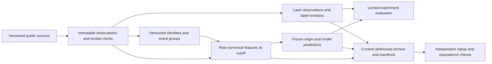

# AREPO Feature Store v2 — permanent causal research specification

Research design, 19 September 2026. No migration or retention change has been performed. “Causal” here means available at the forecast origin, not that an observational association has been identified as a causal effect.

## Decision

Preserve the numerical state used to make every research prediction, together with sufficient inputs, definitions and lineage to reproduce it. A tag such as “large trade”, “unusual activity” or “high conviction” is an additional interpretation, never a replacement for size, depth, price, denominator, timing or uncertainty. Existing raw JSON components must survive any later redesign.

There are two preservation obligations: (1) permanent numerical observation and prediction records for registered experiments; (2) source-event retention sufficient to derive the features and future alternatives. The first does not require keeping every global order-book update forever. The second cannot be satisfied by saving only today's seven scores. Future research questions that cannot be reconstructed after a proposed retention change must be explicitly listed before that change is considered.

## Conceptual data model

These are logical entities, not implementation DDL. Small immutable metadata and current operational indexes can live in PostgreSQL; large immutable observations can live in partitioned Parquet with manifests. Physical placement must not change the logical research contract.

| Entity | Key and essential fields | Purpose |
|---|---|---|
| `source_registry` | source ID; endpoint/topic; licence/access status; schema hash; unit conventions; parser version; documented vs observed status | Identifies the actual source, including protocol era and access limitations. |
| `market_identity_version` | venue; market ID; condition ID; question ID; token ID; outcome index/label; collateral address/decimals; chain ID; event ID; valid-from/to; observed-from/to; mapping version and evidence | Separates Gamma event, economic event, condition and outcome identities. Large token IDs are strings or exact integers, never floating point. |
| `event_group_membership` | group ID; member ID; relationship type; confidence; rule/manual provenance; valid/observed intervals; mapping version | Groups common causes, mutually exclusive outcomes, nested thresholds, recurring releases and related contracts. A graph can have multiple relationship types. |
| `source_observation` | observation ID; source native ID; request/page/cursor; native event/publish times; receive/ingest times; raw object/hash; schema/parser versions; revision link; quality flags | Append-only source envelope. Preserve unknown fields in the raw payload where rights permit. |
| `book_snapshot` and `book_level` | snapshot ID; token; side; level; exact price and size; book hash; sequence if supplied; last update age; snapshot/delta lineage | Retains numerical depth, including zeros and unavailable sides, with reconstruction state. |
| `trade_observation` | source trade ID or documented compound key; token/outcome; side and side-semantics version; price; size; notional; fee; maker/taker addresses when public; transaction/log IDs; match and settlement states | Do not double count the two participant sides or several settlement logs of one economic fill. |
| `wallet_state_version` | public wallet ID; as-of cutoff; first-seen time and coverage start; holdings; flows; historical mature-label scores; uncertainty; role flags; attribution confidence | Distinguishes newly observed from newly created wallets. No person-level identity claim is implied. |
| `information_event_version` | source document/version; text hash; first availability; publication/receive times; entities; claim/event IDs; extraction model/prompt; confidence; matching version; numeric extraction values | Preserves revisions and evidence for quantitative text features. |
| `research_origin` | origin ID; token/market; event-group version; scheduled time; actual forecast origin; eligibility snapshot; inclusion probability; sampling arm; trigger ID; cutoff; provenance class | Freezes the population, including controls and exclusion reasons. |
| `feature_definition` | stable feature ID; definition version/hash; raw dependencies; formula; units; window; alignment rule; minimum coverage; transformation; missingness policy | No silent semantic changes under one column name. |
| `feature_value` | origin ID; feature ID/version; raw decimal/integer value or typed vector; transformed value; numerator/denominator; window start/end; source observation IDs; available-at; quality/missingness | Permanent experiment-ready numerical state. A wide immutable materialisation can coexist with this logical representation. |
| `prediction` | prediction ID; origin; target/version; horizon; full probability vector or predictive distribution; model/train/calibration versions; training-data manifest; feature manifest; generated-at; latency; abstention reason | Store all candidates, including baseline, failed model and ensemble predictions before labels exist. |
| `outcome_observation` | target time; actual quote time; receipt time; quote source/quality; midpoint/bid/ask/depth; executable size; close/resolution state; availability and censoring reasons | Observed facts are separate from target construction. |
| `label_version` | prediction/origin; target definition; label computation version; outcome observation links; label availability; revision/supersession; status | Later corrections never overwrite the original label or historical training manifest. |
| `experiment_run` and `archive_manifest` | protocol/version; folds and event groups; research decisions; all trials; metrics/uncertainty; source hashes; file hashes; row counts; preservation tests | Reproducible negative results and archive equivalence. |

## Identity and event grouping

Use `(venue, market_id)` as a native-market key, `(chain_id, condition_id)` for conditions, and `(chain_id, token_contract, token_id)` for assets. Outcome labels are descriptive, not keys. Preserve token-to-outcome ordering from the source. Market slug/title can change and must not identify a time series. A Gamma event ID is not necessarily the complete independent economic event: several events may depend on the same election, game, asset move or announcement.

Maintain two grouping views. The **as-known grouping** is the only one available as a feature at time t. A **conservative evaluation grouping** can use later information solely to keep related observations together and estimate uncertainty; label it reconstructed and never feed it back into historical features. An event-group correction requires a new split manifest and rerun, not alteration of the old manifest. Unknown group membership remains unknown; using a unique fallback ID does not establish independence.

Existing data have condition IDs but no populated entry event IDs in the audited 110,209 rows. Rebuilding links from historical payloads or current metadata may help grouping; current metadata cannot prove what was known in August. Keep confidence, retrieval date and evidence for every rebuilt link.

## The clock contract

Store separately:

1. `source_event_at`: when the venue says the event happened, retaining raw timestamp text and units.
2. `source_published_at`: publisher's declared release time, nullable and potentially revised.
3. `first_available_at`: independently evidenced first public availability, with evidence and precision; nullable if unknowable.
4. `first_received_at`: first receipt by AREPO, monotonic receipt ordering plus UTC wall clock and estimated clock error.
5. `ingested_at`: durable storage time; ingestion does not establish event time.
6. `available_to_model_at`: maximum of receipt, required parsing and upstream dependency availability.
7. `feature_cutoff_at`: latest permitted dependency availability.
8. `prediction_origin_at` and `prediction_persisted_at`: decision origin and immutable recording time.
9. `target_at`, `label_observed_at`, `label_available_at`: intended horizon, actual observation and usable label time.

For an honest simulation of AREPO, every dependency must satisfy `available_to_model_at <= feature_cutoff_at <= prediction_origin_at`; production latency must be included when interpreting executable value. A reconstructed public-information backtest with credible publication time is a different provenance class from a prospectively observed forecast. An old article returned by today's search does not become available at its printed publication time by assumption.

Current `quote_from_book` assigns `source_timestamp` from the collector clock. Preserve that value but label its semantics as collector time; do not relabel it as exchange time. Unknown historical latency cannot be repaired with a constant subtraction. Existing `exact` labels mean within 900 seconds, so retain actual delay as a number rather than preserving only the word “exact”. [Audited tracking code](https://github.com/dayyansheikh/Arepo/blob/e50f063d1a51a07eb32fcffeedd841b565ebca33/backend/astrolabe/evaluation/research_tracking.py), [constants](https://github.com/dayyansheikh/Arepo/blob/e50f063d1a51a07eb32fcffeedd841b565ebca33/backend/astrolabe/evaluation/research_constants.py).

## Numerical preservation and precision

Store source decimal strings losslessly plus typed decimals for analysis. Integer native units retain token decimals and currency. Prediction-market price is collateral per payout share; probability interpretation must remain separate from fees, redemption mechanics and collateral risk. Time units, book-size units and side interpretation belong in the schema. Avoid rounding to dashboard precision. A source value of 0 is not missing, an empty book is not automatically a successful zero-depth measurement, and a failed request is not an empty response.

For each research observation retain all useful primitive and intermediate numerical quantities: midpoint, bid, ask, prices and sizes at retained levels; depths at fixed price distances; last trade and age; unscaled returns and realised volatility; trade counts, signed and unsigned size/notional, denominators and windows; wallet holdings, history counts, P&L and exposure denominators; related prices and matching confidence; text counts, novelty distances, source counts, surprise inputs and extraction confidence. Retain feature scores, clipping/winsorisation boundaries, training-only normalisation parameters and score-component availability too.

For distributional features retain quantile grids or explicit weighted samples plus exact totals, counts, min/max and coverage. Such summaries cannot recreate arbitrary future quantiles or trade-order dependence; mark that limitation. For wallet-network and burstiness research, summary counts alone are inadequate: retain participant/time/size event sequences in registered windows. For book resiliency and queue-flow research, snapshots alone cannot reconstruct cancellations; retain deltas and sequence/reconnect metadata.

## Missingness and quality vocabulary

Use a nullable value plus a reason, never a magic numeric sentinel. Required reasons: `not_supported`, `not_requested`, `permission_denied`, `rate_limited`, `source_error`, `transport_gap`, `not_yet_available`, `history_truncated`, `stale`, `invalid`, `identity_unresolved`, `not_applicable`, `censored_by_close`, `censored_by_window_end`, `deleted_by_source`, `unknown_legacy`. A genuinely measured zero has reason `observed`, value zero, and positive evidence of coverage.

Quality flags include crossed/one-sided book, timestamp precision, unknown source-clock semantics, incomplete page traversal, duplicate/revision, inconsistent units, stale metadata, blockchain reorganisation and uncertain aggressor attribution. Record coverage fractions and gap lengths numerically. A model may use missingness if it improves prospectively, but this can encode collection policy; test its stability and prohibit claiming it is trader information without evidence.

## Preservation matrix — before retention decisions

| Material | Permanent requirement | High-frequency retention decision |
|---|---|---|
| All frozen cohorts, entry identities, components, cutoffs, predictions, labels and revisions | Exact complete preservation, including failed/abstained candidates | No deletion recommendation in this report. |
| Raw numerical observation at registered forecast origins and sampled controls | All primitives and intermediate values used or scientifically plausible; exact units and lineage | Permanent independent of hot/cold placement. |
| Market rules, descriptions, event links, tick/fee/incentive configuration | Versioned as observed, with effective and observation times | Retain every change affecting an experiment. |
| Full books and delta sequences | Permanent windows for registered microstructure experiments, all origins/controls and representative randomly selected audit windows | Global indefinite retention is optional; determine coverage, future-feature loss and cost first. |
| Raw trade records | Exact registered-universe fills and identifiers for flow/wallet research | Cold tier is preferable to throwing away numeric sizes. Historic on-chain recovery does not restore off-chain receipt times. |
| Wallet and related-market state | Historical as-of states, numerator/denominator and coverage; mature-label history only | Current leaderboard snapshots cannot replace historical state. |
| Text and external releases | Rights-permitted original/versioned evidence, hashes, numeric extractions, original availability and prompts/models | If raw text retention is restricted, preserve permitted features and pointers; acknowledge loss of re-extractability. |
| Reconstructable operational caches | Manifest proving inputs and reconstruction are available | Candidate for later expiry after equivalence passes; not the authoritative research record. |
| Redundant JSON/database indexes | Preserve semantically exact canonical data, schema and audit traces first | Possible future compaction, not approved or implemented here. |

## Archive-equivalence acceptance protocol

No proposed deletion passes on row counts alone. Test old and candidate archives in independent readers before any later operational approval. Use all cohorts for identity and linkage checks, and stratified replay spanning protocol eras, categories, probability/liquidity regimes, missing components, zero values, delayed labels, closures and duplicate daily/weekly origins. Include random source windows, not only successful signals.

1. **Inventory:** hash all source files/manifests; count exact rows, unique keys, duplicate keys, event-group memberships, orphan labels, schema/parser versions and provenance classes. Require exact equality.
2. **Identity:** native IDs, token/outcome order, condition and collateral mappings, cohort membership, inclusion probabilities and exclusion reasons must match exactly. No implicit relinking to current metadata.
3. **Time:** all timestamp values, precision, raw units and semantic labels must match exactly. Preserve nulls and uncertainty. Replayed as-of joins must never include a dependency unavailable at origin.
4. **Numbers:** source integers and decimal strings must round-trip exactly. For intentionally recomputed floating-point derived quantities, declare tolerances per feature in advance, tied to numerical conditioning rather than a convenient global epsilon. Never allow a tolerance to change a class boundary or ranking silently.
5. **Missingness:** value/reason/quality/coverage distributions and row-level values must be equal. Zero-to-null and null-to-zero conversions are hard failures.
6. **Feature replay:** reconstruct registered features and at least the numerical challengers in the Feature Research Register, including numerator/denominator and window membership. Explicitly enumerate features lost because their raw sequence was not retained.
7. **Prediction replay:** reproduce current AREPO direction/rank, momentum and richer baselines using pinned definitions. Compare full probability vectors for models once they exist, selected top-K, ties and abstentions.
8. **Outcome linkage:** same target time, actual quote time, delay, censoring, cost version and final-resolution revision must attach to every prediction. Compare score and coverage reports by fold and event group.
9. **Operational restoration:** independently read a sample and a full cohort from cold storage, verify checksums, access rights, restoration duration and query cost. Test a deliberately corrupted file and missing partition.
10. **Acceptance:** zero unresolved identity/time/provenance failures; all declared numeric tolerances satisfied; no unacknowledged feature loss; signed preservation report and rollback copies. Then, and only then, a separate authorised retention decision can be considered.

The audited data cannot recover unrecorded exchange timestamps, missing event-time availability, never-collected book/flow history, or the three universally absent score components merely by changing file format. These are prospective collection requirements, not archive defects that compression can solve.

## Lineage

Physical formats should support projection and partition pruning. DuckDB and Polars are plausible research readers, not mandatory infrastructure replacements. Benchmark them on an archived cohort before committing. [DuckDB Parquet documentation](https://duckdb.org/docs/stable/data/parquet/overview), [Polars multiple-file scans](https://docs.pola.rs/user-guide/io/multiple/).
